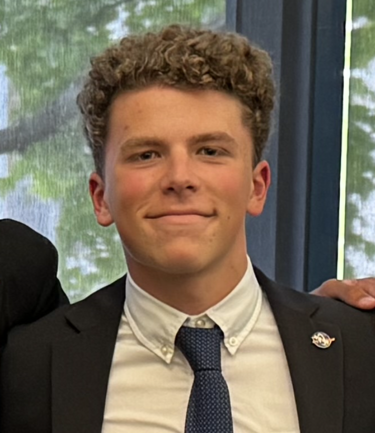

# Project Portfolio (WIP)

<section class="header">
    

        

            
        

        

            <h1>Alex Reich</h1>
            
[placeholder text]

            

            
alre8317@colorado.edu

            

                
                    <i class="fa fa-linkedin-square" aria-hidden="true"></i>
                

                
                    <i class="fa fa-github" aria-hidden="true"></i>
                
            

        

    

</section>

| [**BIO**](#bio) | [**EDUCATION**](#education) | [**EXPERIENCE**](#experience) | [**PROJECTS**](#projects) | [**CONTACT**](#contact) |

## Bio 

Hi, I'm Alex. I am a sophomore at CU Boulder studying aerospace and electrical engineering. I am passionate about contributing to the future of space exploration through developing avionics, control systems, and GNC algorithms for spacecraft.

## Education 

University of Colorado, Boulder class of 2027

B.S. Aerospace Engineering, minor in Electrical Engineering

## Experience 

View my full resume [here](Alex_Reich_2024-7_Resume.pdf)

CU Sounding Rocket Lab (SRL) Avionics Lead

NASA SUITS Team Co-Lead (Team Cartographer)

## Projects 

<!-- [General Engineering Projects](https://areich128.github.io/Projects/projects.html)

[Software Projects](https://areich128.github.io/Software/software.html)

[Circuit Design Projects](https://areich128.github.io/CircuitDesign/circuitdes.html) -->

## Contact 

Feel free to message me on [LinkedIn](https://www.linkedin.com/in/alex-reich-650683252/) or shoot me an email at [alre8317@colorado.edu](alre8317@colorado.edu)