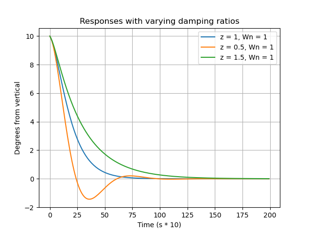
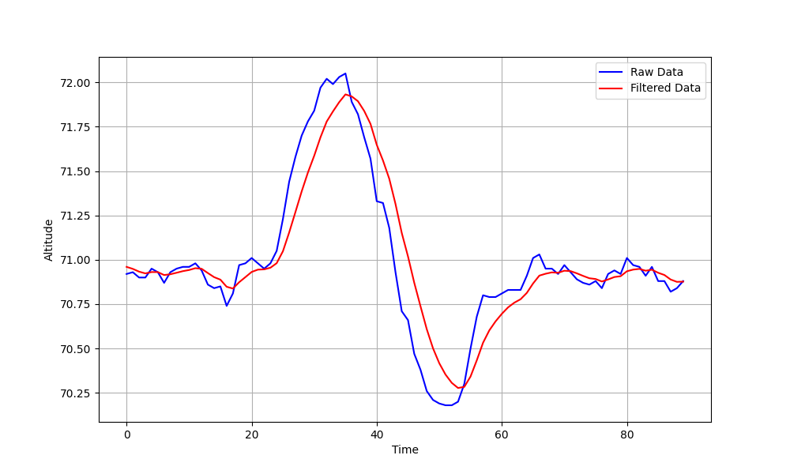

# Project Portfolio (WIP)

<head>
    <meta charset="UTF-8">
    <meta name="viewport" content="width=device-width, initial-scale=1.0">
    <title>Your Profile Page</title>
    <link href="https://cdnjs.cloudflare.com/ajax/libs/font-awesome/6.5.2/css/all.min.css" rel="stylesheet">
    
    
</head>

| [**BIO**](#bio) | [**EDUCATION**](#education) | [**EXPERIENCE**](#experience) | [**PROJECTS**](#projects) | [**CONTACT**](#contact) |

## Bio 

Hi, I'm Alex. I am a sophomore at CU Boulder studying aerospace and electrical engineering. I am passionate about contributing to the future of space exploration through developing avionics, control systems, and GNC algorithms for spacecraft.

## Education 

University of Colorado, Boulder class of 2027

B.S. Aerospace Engineering, minor in Electrical Engineering

## Experience 

View my full resume [here](Alex_Reich_2024-7_Resume.pdf)

CU Sounding Rocket Lab (SRL) Avionics Lead

NASA SUITS Team Co-Lead (Team Cartographer)

## Projects 

### Inverted Pendulum Simulation and Control

Determined system dynamics equations, created control architecture and algorithm, and tuned using MATLAB. Code can be found [here](https://github.com/areich128/ControlAlgorithms/tree/master/MCMC)

### PD Controller for 1-DOF Thrust Vector Control

Determined system dynamics and transfer equations, created PD controller and tuned gains to be able to dictate natural frequency and damping ratio. Code can be found [here](https://github.com/areich128/ControlAlgorithms/tree/master/PD_Algo)

    

### 5th Kibo RPC

Created pathfinding algorithm to scan images throughout the Kibo ISS module while avoiding Keep-Out-Zones and following a near-optimal path. Team was awarded **US Top 10**.

### Kalman Filter

Created univariate Kalman filter algorithm based off [this](https://www.kalmanfilter.net/alphabeta.html) tutorial. Applied it to altitude readings made by the BMP388 barometric altitude sensor. Code can be found [here](https://github.com/areich128/KalmanFilter)

    

### NASA Space Apps Hackathon (2023)

### Coilgun

Designed and implemented circuit to launch a small metal projectile using electromagnetic propulsion.

### Marx Generator

<!-- [General Engineering Projects](https://areich128.github.io/Projects/projects.html)

[Software Projects](https://areich128.github.io/Software/software.html)

[Circuit Design Projects](https://areich128.github.io/CircuitDesign/circuitdes.html) -->

## Contact 

    <a> alre8317@colorado.edu </a>
    <a href="https://www.linkedin.com/in/alex-reich-650683252/" target="_blank" class="social-icons">
        <i class="fab fa-linkedin fa-2x"></i>
    </a>
    <a href="https://github.com/areich128" target="_blank" class="social-icons">
        <i class="fab fa-github fa-2x"></i>
    </a>

