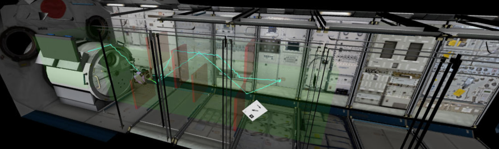

# Project Portfolio (WIP)

<head>
    <meta charset="UTF-8">
    <meta name="viewport" content="width=device-width, initial-scale=1.0">
    <title>Your Profile Page</title>
    <link href="https://cdnjs.cloudflare.com/ajax/libs/font-awesome/6.5.2/css/all.min.css" rel="stylesheet">
    
    
</head>

| [**BIO**](#bio) | [**EDUCATION**](#education) | [**EXPERIENCE**](#experience) | [**PROJECTS**](#projects) | [**CONTACT**](#contact) |

 

## Bio 

Hi, I'm Alex! I am a sophomore at CU Boulder studying aerospace and electrical engineering. I am passionate about contributing to the future of space exploration through developing avionics, control systems, and GNC algorithms for spacecraft.

 

## Education 

University of Colorado, Boulder class of 2027

B.S. Aerospace Engineering, minor in Electrical Engineering

 

## Experience 

View my full resume [here](Alex_Reich_2024-7_Resume.pdf)

### Avionics Lead, CU Sounding Rocket Lab

Responsible for organizing the creation of a full avionics system including updating an existing sensor suite, adding RF downlink capability, and adding pyro channels to meet deployment requirements.

### Avionics Engineer, CU Sounding Rocket Lab

Designed and implemented custom sensor drivers and employing low-level serial communications protocols using NASA's FPrime flight software framework.

### NASA SUITS Team Co-Lead (Team Cartographer)

Coordinated the design and implementation of an augmented reality EVA assistance system and associated mission control console. Testing at the Johnson Space Center Rock Yard demonstrated a significant decrease in cognitive load on the "astronaut" during simulated EVA tasks.

 

## Projects 

### Inverted Pendulum Simulation and Control

Determined system dynamics equations, created control architecture and algorithm, and tuned using the Markov Chain Monte Carlo method in MATLAB. Code can be found [here](https://github.com/areich128/ControlAlgorithms/tree/master/MCMC).

    <video controls style="width: 45%; height: auto; margin-left: auto; margin-right: auto;">
        <source src="pendulum_swingup.mp4" type="video/mp4">
    </video>
    

 

### PD Controller for 1-DOF Thrust Vector Control

Determined system dynamics and transfer equations, created PD controller and tuned gains to be able to dictate natural frequency and damping ratio. Code can be found [here](https://github.com/areich128/ControlAlgorithms/tree/master/PD_Algo).

    
    

 

### 5th Kibo RPC

Created pathfinding algorithm to guide the AstroBee robot through a simulated Kibo ISS module while scanning images, avoiding Keep-Out-Zones and following a near-optimal path. Team was awarded **US Top 10**.

    

 

### Kalman Filter

Created univariate Kalman filter algorithm based off [this](https://www.kalmanfilter.net/alphabeta.html) tutorial. Applied it to altitude readings made by the BMP388 barometric altitude sensor. Code can be found [here](https://github.com/areich128/KalmanFilter).

    

*Lag in filtered data was later fixed by increasing process noise variance.*

 

### Coilgun

Created circuit to launch a small metal projectile using electromagnetic propulsion.

### Marx Generator

Designed and implemented high voltage generator.

 

<!-- [General Engineering Projects](https://areich128.github.io/Projects/projects.html)

[Software Projects](https://areich128.github.io/Software/software.html)

[Circuit Design Projects](https://areich128.github.io/CircuitDesign/circuitdes.html) -->

## Contact 

    

        <a href="alre8317@colorado.edu" target="_blank" class="social-icons">
            <i class="fa fa-envelope fa-2x"></i>
        </a>
    

    

        <a href="https://www.linkedin.com/in/alex-reich-650683252/" target="_blank" class="social-icons">
            <i class="fab fa-linkedin fa-2x"></i>
        </a>
    

    

        <a href="https://github.com/areich128" target="_blank" class="social-icons">
            <i class="fab fa-github fa-2x"></i>
        </a>
    

